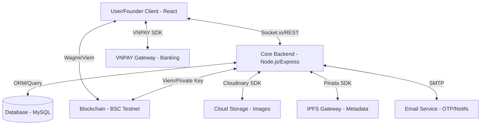

<div align="center">
  

# 🎗️ HopeFund — Charity Donation Platform

**The Future of Transparent Giving: A Hybrid Web3 Charity Ecosystem**

[](https://nodejs.org/)
[](https://react.dev/)
[](https://vitejs.dev/)
[](https://www.mysql.com/)
[](https://soliditylang.org/)

  <p align="center">
    <a href="#📖-introduction">Introduction</a> •
    <a href="#🛠️-technology-stack">Tech Stack</a> •
    <a href="#✨-features">Features</a> •
    <a href="#🏗️-architecture">Architecture</a> •
    <a href="#📂-project-structure">Structure</a> •
    <a href="#⚙️-installation">Installation</a> •
    <a href="#🚀-usage">Usage</a>
  </p>
</div>

---

## 📖 Introduction

**HopeFund** is a revolutionary, transparent charity donation platform designed to bridge the gap between traditional fiat donations and the modern Web3 ecosystem. By leveraging both **Banking (VNPAY)** and **Blockchain (USDT on BSC Testnet)**, HopeFund provides a secure, auditable, and user-friendly experience for donors, founders, and administrators.

Every donation on HopeFund is either verified through a secure payment gateway or recorded indefinitely on the blockchain, ensuring that your contribution reaches those in need with **100% transparency**.

---

## 🛠️ Technology Stack

| Layer | Technologies |
|-------|-------------|
| **Frontend** | React 19, Vite 7, React Router, Wagmi, Viem, Axios |
| **Backend** | Node.js, Express 5, Socket.IO, JWT, Nodemailer |
| **Database** | MySQL 8.0 |
| **Blockchain** | Solidity, BSC Testnet, WalletConnect |
| **Storage** | Cloudinary (Images), Pinata (IPFS Meta) |
| **Payment** | Banking (VNPAY), Crypto (USDT BEP-20) |

---

## ✨ Features

### 🔐 1. Identity & Security
- **Dual Login**: Authentication via Google OAuth2 or MetaMask Wallet.
- **Robust Auth**: JWT-based session management with Access/Refresh token rotation.
- **Verification**: OTP-based email verification to ensure real users.
- **Protective Layer**: Backend rate-limiting to prevent brute-force and spam attacks.

### 💰 2. Hybrid Donation Gateway
- **Banking**: Integrated with VNPAY for familiar, high-speed fiat donations.
- **Crypto**: Direct USDT contributions to on-chain project vaults.
- **Auditing**: Every crypto donation is linkable to the BSC Explorer.

### 🏦 3. Smart Vault Technology
- **Isolation**: Each project has its own dedicated on-chain **Vault**.
- **Governance**: Multi-stage withdrawal flow (Request → Email Verify → Admin Approval → On-chain Claim).
- **Security**: Cryptographic signatures for secure, off-chain admin approval.

### 👤 4. User Experience & Gamification
- **Badge System**: Earn status based on donation volume (Supporter → Philanthropist).
- **Social Proof**: Public user profiles with donation history and earned badges.
- **Real-time**: Live notifications for project approvals and activities via Socket.IO.

### 🛠️ 5. Administrative Control
- **Insights**: Full dashboard with analytics on donations, users, and project performance.
- **Lifecycle**: Complete management of project proposals from draft to vault deployment.
- **Moderation**: Centralized system for category and badge configuration.

---

## 🏗️ Architecture



---

## 📂 Project Structure

### Backend (Node.js - MVC Pattern)
```
backend/src/
├── config/             # DB, Mail, Cloudinary & Blockchain config
├── controllers/        # Request handling logic (Auth, Projects, Donations...)
├── middleware/         # Auth (JWT), Roles, RateLimit, Uploads
├── models/             # Database queries (MySQL)
├── routes/             # API endpoint definitions
├── services/           # Business logic & 3rd-party integrations
└── utils/              # Help functions (JWT signer, constants)
```

### Frontend (React - Component Architecture)
```
frontend/src/
├── api/                # Axios instances & API modules
├── components/         # Reusable UI (Navbar, Cards, Modals, Forms)
├── context/            # Global State (Authentication)
├── hooks/              # Custom hooks (Web3 hooks, Sockets, Logic)
├── layouts/            # Page layouts (Main, Admin Dash)
├── pages/              # Domain components (Home, Profile, Projects)
└── routes/             # Client-side routing logic
```

### Smart Contracts (Hardhat)
```
contract/
├── contracts/          # Solidity source code
├── scripts/            # Deployment & Maintenance scripts
└── test/               # Smart contract unit tests
```

---

## ⚙️ Installation

### 1. Database Setup
```bash
# 1. Create a database in MySQL
CREATE DATABASE charity_db;

# 2. Import initial schema
mysql -u root -p charity_db < database/schema.sql

# 3. Apply migrations (found in database/migrations.sql)
# These are manual logs of changes made during development.
```

### 2. Backend Config
```bash
cd backend && npm install

# Create .env with the following core sections:
# - DB Config (HOST, USER, PASS, NAME)
# - JWT Secrets (ACCESS, REFRESH)
# - Google API (CLIENT_ID)
# - Blockchain Config (ADMIN_PRIVATE_KEY, FACTORY_ADDRESS)
# - VNPAY & Cloudinary credentials

npm run dev
```

### 3. Frontend Config
```bash
cd frontend && npm install

# Create .env with:
# - VITE_API_BASE_URL
# - VITE_SOCKET_URL
# - VITE_WALLETCONNECT_PROJECT_ID
# - VITE_BSC_EXPLORER_URL

npm run dev
```

---

## 🔒 API Documentation (Core Endpoints)

Sensitive endpoints are protected with rate limiting:

| Method | Endpoint | Description | Limit |
|:---:|:---|:---|:---:|
| POST | `/api/auth/login` | Google OAuth / Email login | 10/15m |
| POST | `/api/auth/wallet/login` | Sign-in via MetaMask | 10/15m |
| POST | `/api/donations/projects/:id/donate` | Create Banking/Crypto donation | 30/15m |
| POST | `/api/users/send-verification-otp` | Trigger verification email | 3/15m |
| POST | `/api/projects` | Submit new project proposal | 10/15m |

---

## 📄 License 

- **License**: Educational purpose only.

<div align="center">
  <br />
  <p><strong>Built with ❤️ by the HopeFund Team</strong></p>
</div>
